## Section 01 Introduction

Introduction.

# What I Learned

# Welcome and Course Goals

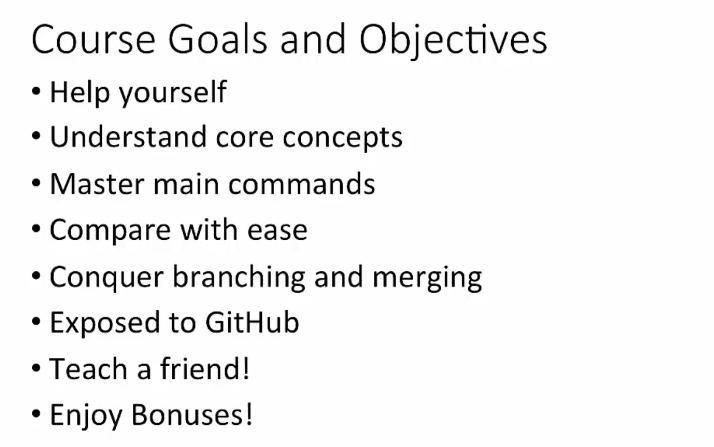

# Course Overview

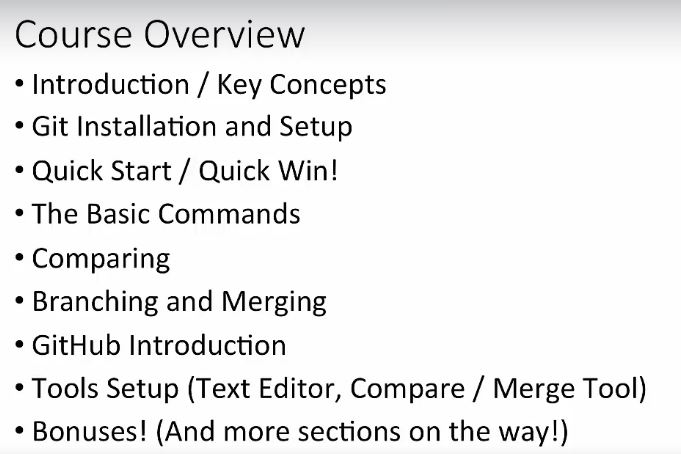

# Course Audience and Course Study Tips

- Basic information.

# Why Command Line?

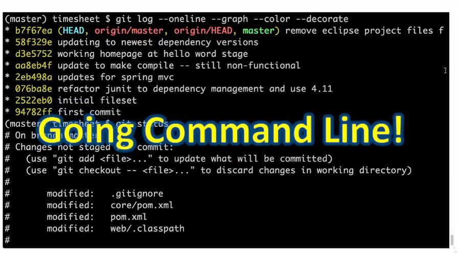

 

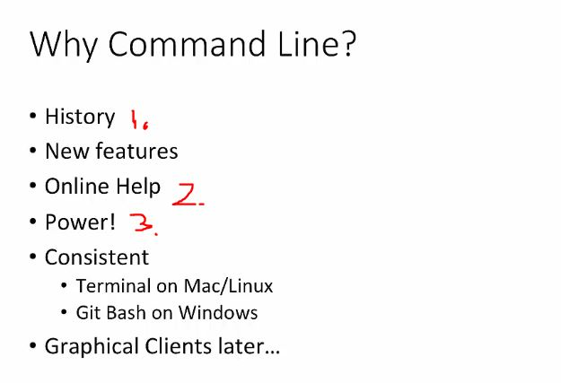

1. **GIT** was designed as command line tool.

2. Most of documentation in online is for command line tool.

3. Most GUI implementations are not implementing most powerful tools which **GIT** provides.

# Why Source Control?

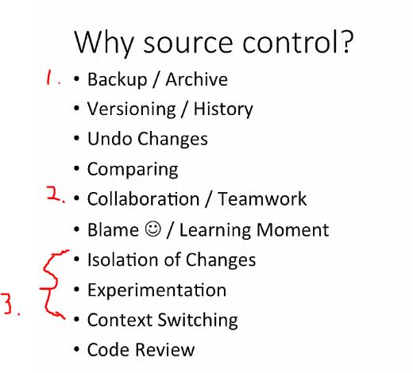

1. It work as backup.
2. Can be used for teamwork.
3. Encourages experimentation in own branch in safe way.

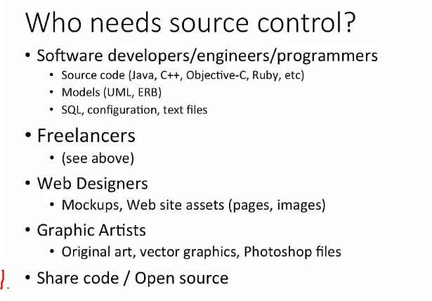

1. All major open source projects are using GIT. 

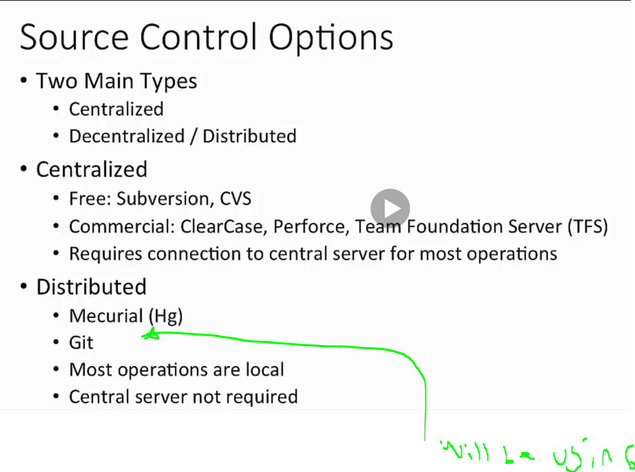

 # Why Git?

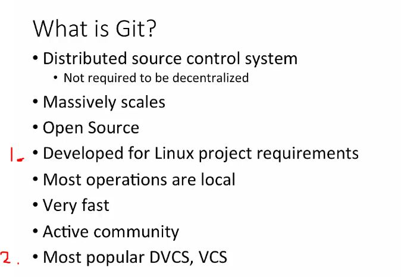

1. Creator of Git **Linus Torvalds** wanted system which can handle the linux files.

2. Most popular version control system. Wide adaption and integration to other tools!
    - Bug tracking system.
    - Build servers.

# Key Git Terminology

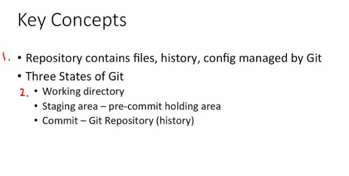

1. In **Git**, version control files is kept inside repository.

- `/.git` folder which contains **actual** repository.

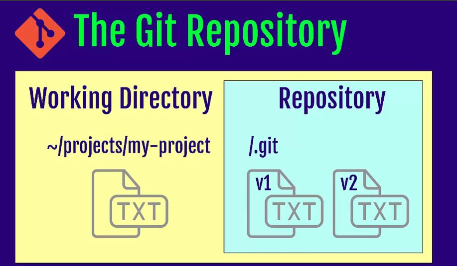

- Repository contains history of changes and any special configurations.

2. Working directory/folder holds application files.
    - Git may or may not be manage them, but is **aware** of them.

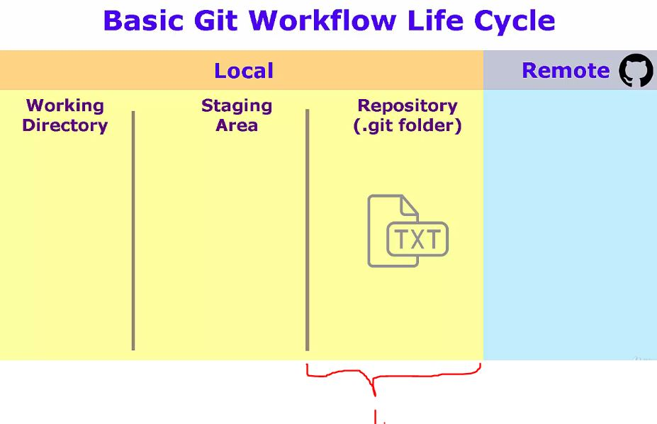

1. All the changes that are finalized are held here.

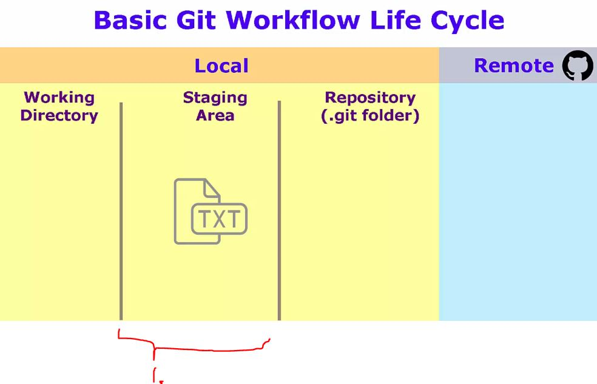

1. Git **stating area** or **git index**. Holding area for next commit.
    - You can move in and out files from this area whiteout affecting change history.

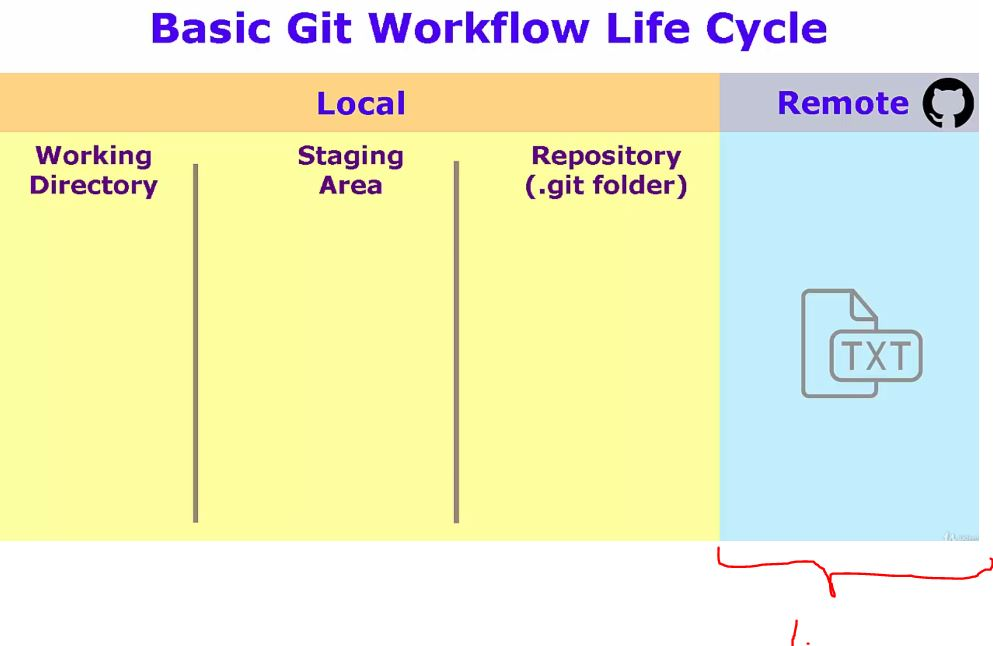

1. It can be "thinked" as last stage of git.

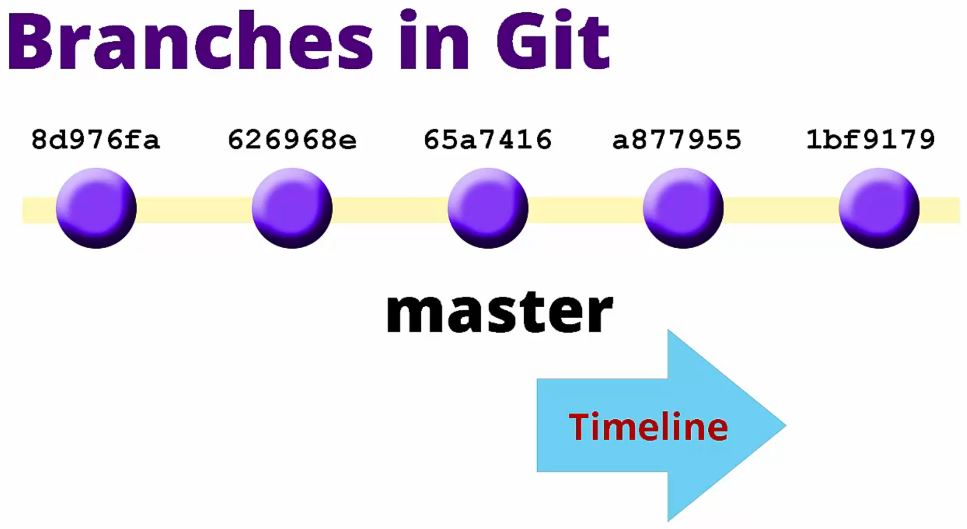

- **Branches** are timeline that contain your changes!
- In Git **Branches** contains commits.
- Git default branch is **master**.