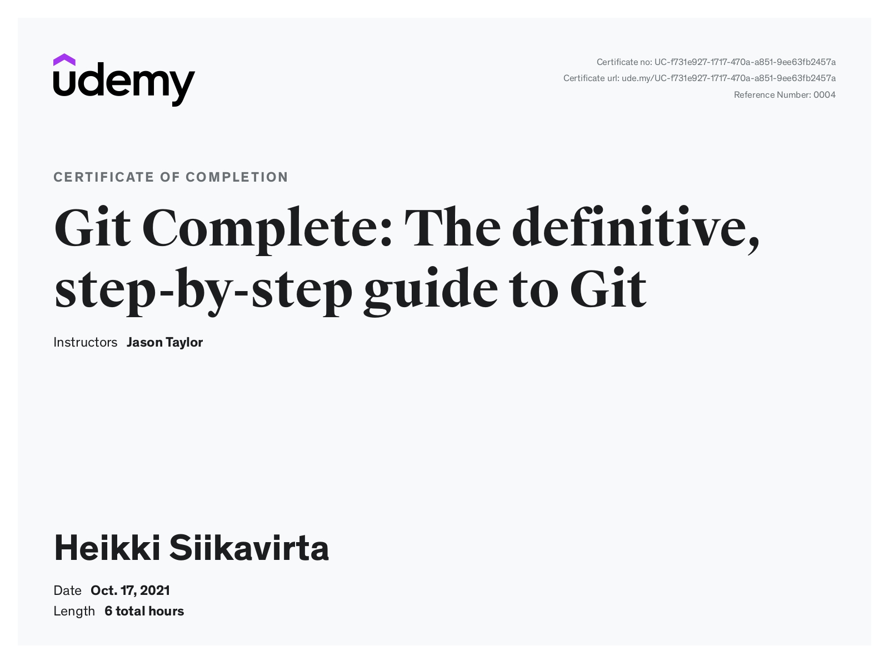
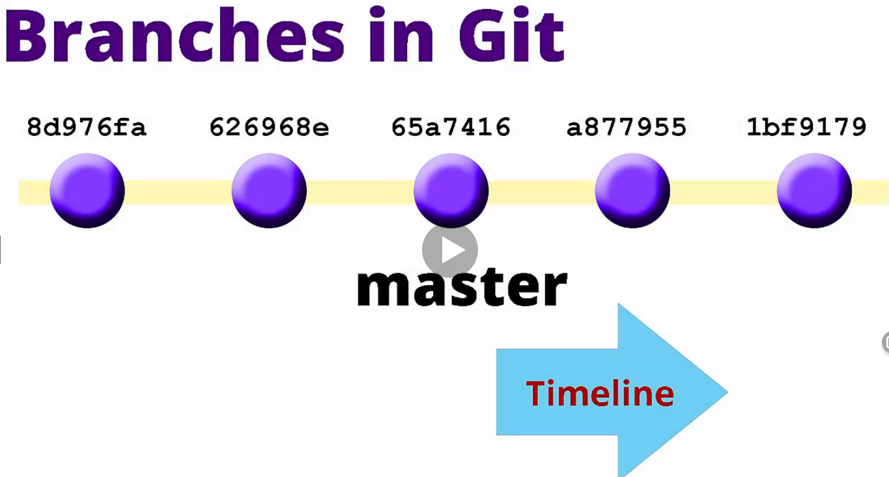
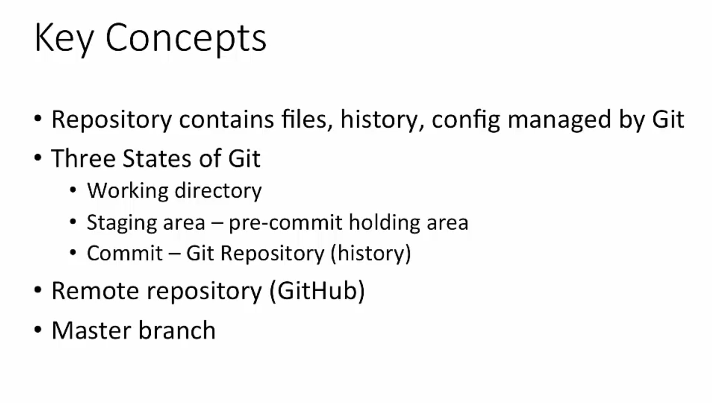
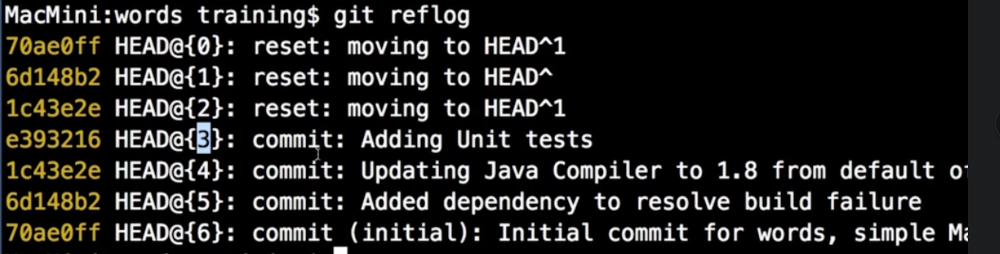

## Git Complete: The definitive, step-by-step guide to Git 

Boosting my Git skills.
All coursework for the Git Complete: The definitive, step-by-step guide to Git by **Jason Taylor** and **John Myers**. With my own added notes.

[The Course at Udemy](https://www.udemy.com/course/git-complete/)  

If the content sparked :fire: your interest, please consider buying the course and start learning :book:.

<!-- 
LinkedIn puts this shit front, when clicking from private mode x(. Need to put this to make jump working every case
?trk=public_profile_see-credential 
-->

- Todo [git bisect](https://www.youtube.com/watch?v=aulaZBVS16g&list=WL&index=98)

**Note: The material provided in this repository is only for helping those who may get stuck at any point of time in the course. It is very advised that no one should just copy the solutions(violation of Honor Code) presented here.**

## Progress/Curriculum

- [x] 01 - [Section 01](https://github.com/developersCradle/git-complete/tree/master/Section%2001%20Introduction) - Introduction ✔️
- [x] 02 - [Section 02](https://github.com/developersCradle/git-complete/tree/master/Section%2002%20Git%20Installation) - Git Installation ✔️
- [x] 03 - [Section 03](https://github.com/developersCradle/git-complete/tree/master/Section%2003%20Git%20Quick%20Start) - Git Quick Start ✔️ 
- [x] 04 - [Section 04](https://github.com/developersCradle/git-complete/tree/master/Section%2004%20GitHub%20Updates) - GitHub Updates ✔️ 
- [x] 05 - [Section 04](https://github.com/developersCradle/git-complete/tree/master/Section%2004%20Text%20Editor%20Installation) - Text Editor Installation ✔️
- [x] 06 - [Section 05](https://github.com/developersCradle/git-complete/tree/master/Section%2005%20Basic%20Git%20Commands) - Basic Git Commands
- [x] 07 - [Section 06](https://github.com/developersCradle/git-complete/tree/master/Section%2006%20Visual%20MergeDiff%20Tool%20Installation) - Visual Merge/Diff Tool Installation
- [x] 08 - [Section 07](https://github.com/developersCradle/git-complete/tree/master/Section%2007%20Comparisons) - Comparisons
- [x] 09 - [Section 08](https://github.com/developersCradle/git-complete/tree/master/Section%2008%20Branching%20and%20Merging) - Branching and Merging
- [x] 10 - [Section 09](https://github.com/developersCradle/git-complete/tree/master/Section%2009%20Rebasing) - Rebasing
- [x] 11 - [Section 10](https://github.com/developersCradle/git-complete/tree/master/Section%2010%20Stashing) - Stashing
- [x] 12 - [Section 11](https://github.com/developersCradle/git-complete/tree/master/Section%2011%20Tagging) - Tagging
- [x] 13 - [Section 12](https://github.com/developersCradle/git-complete/tree/master/Section%2012%20Bonus%20Office%20Hour%20Sessions) - Bonus: Office Hour Sessions
- [x] 14 - [Section 13](https://github.com/developersCradle/git-complete/tree/master/Section%2013%20Updates%20and%20Errata) - Updates and Errata
- [x] 15 - [Section 14](https://github.com/developersCradle/git-complete/tree/master/Section%2014%20Bonus%20Resources%20and%20Special%20Offers) - Bonus: Resources and Special Offers

## Notes/Commands

Branches have such life cycle, increases to right

- [hipsum](https://hipsum.co/)

`origin/master` origin is reference to github repository, and master is branch
`git status` command keeps track of origin master
**Best practise** is do **pull** before **push**

- Basic Git Workflow

 

You see their main working areas, **Working**, **Staging** and **Repository**

- Git Tracked file

Listing tracked files
- `git ls-files`

Git status only shows first level of directories

Adding file recursively
- `git add .`

Backing out changes form staging area
- `git reset HEAD "filename.here"`

Going back state when files were last committed
- `git checkout -- "filename.here"`

When moving or renaming files in encouraged to to use git mv
- `git mv`

Moving file one level down
- `mv level2.txt ..`

Deleting file
- `rm "filename"`

Getting log
- `git log`

Inspecting individual log of file
- `git log -- "filename"`

Creating alias for `"log --all --graph --decorate --oneline"`
- `git config --global alias.hist "log --all --graph --decorate --oneline"`

Now this can be executed
- `git hist`

To tell git ignore specified untracked files, add to `.gitignore` file

Creating `.gitignore`
- `npp .gitignore`

Format for **.gitignore**

Telling git default merge tool
- `git config --global merge.tool p4merge`

Telling location of merge tool
- `git config --global mergetool.p4merge.path "D:/Program Files/p4merge.exe"`

Telling git default **diff tool**
- `git config --global diff.tool p4merge`

Telling location of diff tool
- `git config --global difftool.p4merge.path "D:/Program Files/p4merge.exe"`

Disabling Prompt, removing extra nag when needing resolve the conflict
- `git config --global difftool.prompt false`
- `git config --global mergetool.prompt false`

Comparing in git, compares working directory and staging area to each other
- `git diff`

Compare in visual diff tool if configured in git
- `git diftool`

HEAD point to the branch where we are on
HEAD is last commit in this branch

Comparing working directory and git repository 
- `git difftool HEAD`
- `git diff HEAD`

Comparing staging area and git repository

- `git difftool --staged HEAD`
- `git diff --staged HEAD`

Diffing separate files
- `git diff -- README.md`
- `git difftool-- README.md`

Comparing between two commits
- `git diff 0108803 HEAD`
OR
- `git diff 0108803 effe8b6`
HEAD points to last commit in current branch 
Comparing HEAD and HEAD -1
- `git diff HEAD HEAD^`

Comparing local and remote master branch

- `git diff master origin/master`

Listing current branches
- `git branch -a`

Creating branch
- `git branch mynewbranch`

Switching branch
- `git checkout mynewbranch`

Renaming branch
- `git branch -m mynewbranch newbranch`

Deleting branch, deletes labels
- `git branch -d newbranch`

Diffing master branch to title-change branch
- `git diff master title-change`

Merging title-change branch to current branch
- `git merge title-change`

Fast-forward merge is possible if there is no changed made on the target branch

Branch merge whiteout fast-forward

**Upper line** what is from master and **bottom line** what is from real work branch

- `git merge add-copyright -no-ff`

**HEAD** is referring to masters
- HEAD points to current branch
	- When checkout to another branch → so does head update pointing to this branch

Check where HEAD points in your machine! `cat .git/HEAD`

During resolving the merge git will save original copy of the merge conflicts for backup

Rebase is getting changes from one branch to another
- `git rebase master`

**DETACHED HEAD** is when head is pointing to commit not to branch

Aborting rebase
- `git rebase --abort`

**Rebase conflict** should be treated like **merge conflict**

Updating references, updates references between local and remote repositories

- `git fetch origin master`
	- In the simplest terms, `git pull` does a `git fetch` followed by a `git merge`.

Invoking git stash, add modified files to stash
- `git stash` is default for `git stash save`

Applying stash
- `git stash apply`

List stashes
- `git stash list`

Drops last stash
- `git stash drop`

Getting first form stash list
- `git stash pop`

Making commit message for stash
- `git stash save "simple changes"`

3 Stashes

Showing specific stash 
`@` reflog syntax
- `git stash show stash@{1}`

Applying specific stash
- `git stash apply stash@{1}`

Dropping specific stash
- `git stash drop stash@{1}`

Emptying empty of stashes
- `git stash clear`

Adding files to stash new files and modified files
- `git stash -u`

Creating, switching branch, applying and destroying stash all in one
- `git stash branch newchanges`

Tags are just labels which we can attack to any commit in history
Creates **myTag**, lightweight tag
- `git tag myTag`

Showing list of tags
- `git tag --list`

Deleting tag
- `git tag --delete myTag`

Annotated tag has little more extra information than normal tag
- `git tag -a v-1.0`

Listing tag
- `git tag --list`

Showing the tag
- `git show v-1.0`

Comparing tags
- `git diff v-1.0 v-1.2`

Tagging specific Commit
- `git tag -a v-0.9-beta 21df23a`

Editing tag
- `git tag -a v-0.8-alpha -f bd35d46`

Pushing all tags
- `git push origin master --tags`

OFFICE HOUR SESSION
-------------------

Reset back one level 

- `git reset HEAD^1`

Reset back two level
- `git reset^2`

Log of everything what we have done

- `git reflog`

Resetting to specific place
- `git reset e343212`

Resetting to specific place using @ marking, works with stashes
- `git reset HEAD@{2}`

Show local and remote branches
- `git branch -a`

Get references that have changes in remote repository
- `git fetch`

To make git save long filenames, use following.
- `git config --system core.longpaths true`

## Additional stuff
- https://marklodato.github.io/visual-git-guide/index-en.html
- https://www.youtube.com/watch?v=uR6G2v_WsRA Core Concepts 1
- https://www.youtube.com/watch?v=FyAAIHHClqI Branching and Merging 2
- https://www.youtube.com/watch?v=Gg4bLk8cGNo Remotes 3

