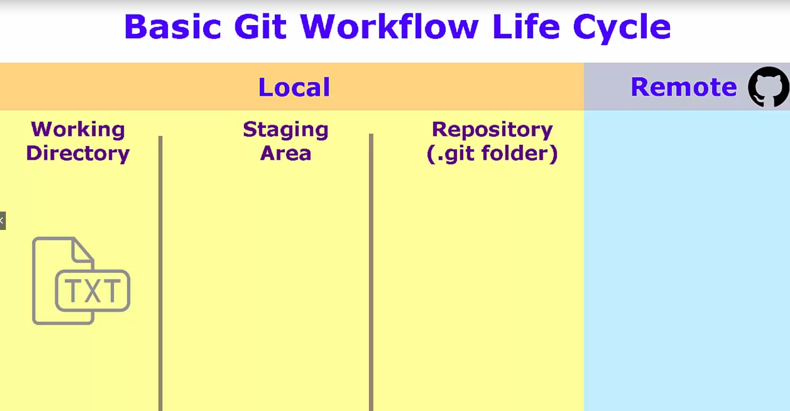
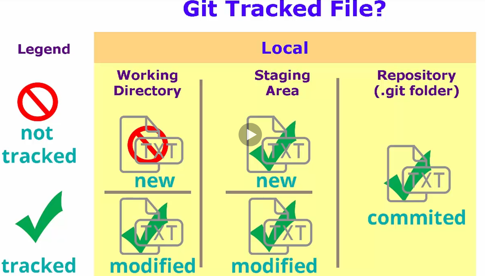
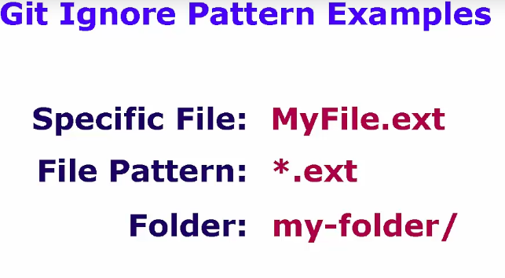
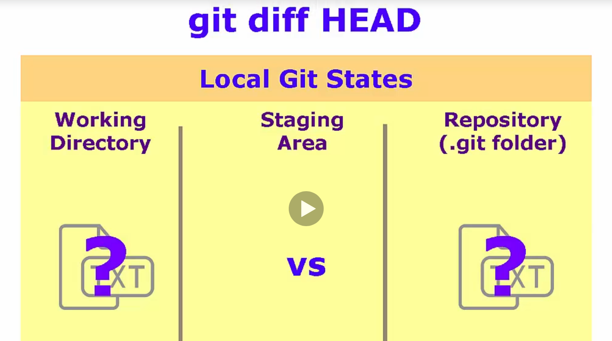
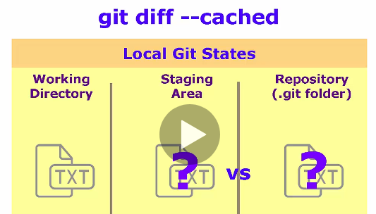
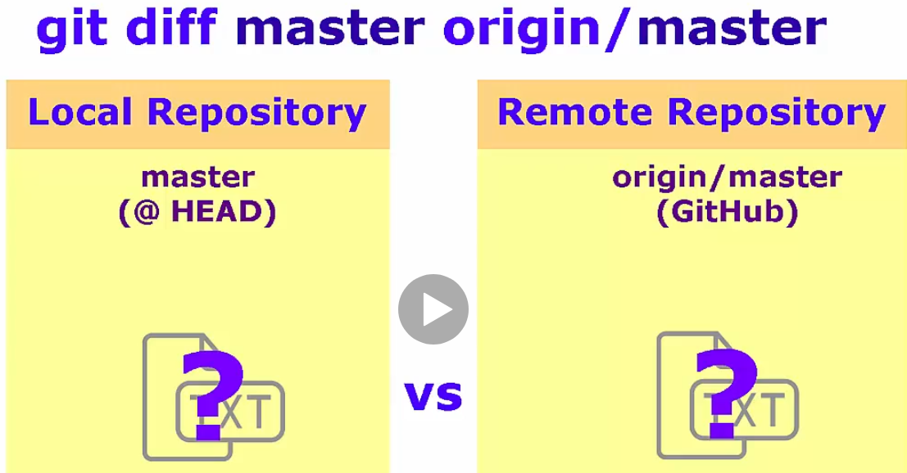
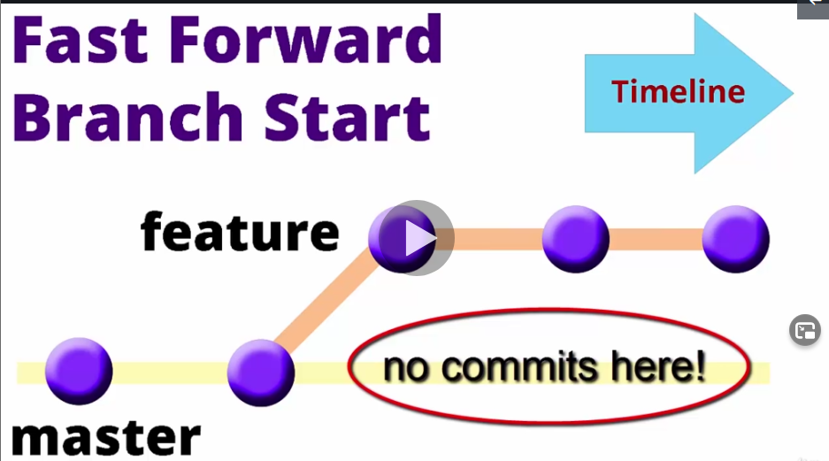
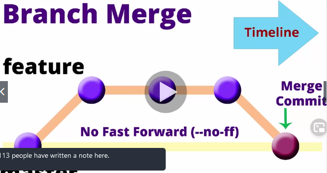
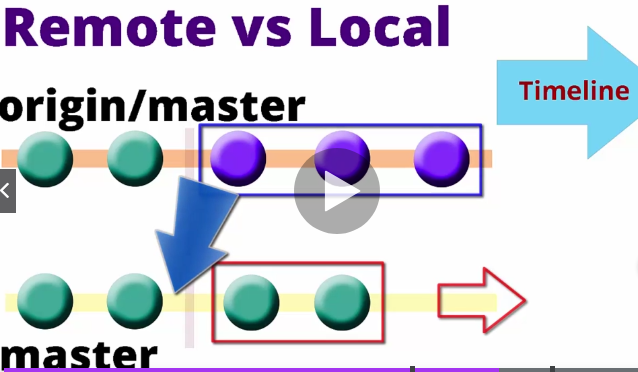
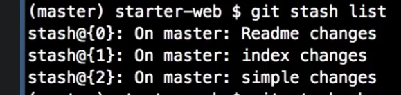

## Git Complete: The definitive, step-by-step guide to Git 

Boosting my Git skils.

## Progress/Curriculum

- [x] 01 - Introduction 
- [x] 02 - Git Installation
- [x] 03 - Git Quick Start
- [x] 04 - Text Editor Installation
- [x] 05 - Basic Git Commands
- [x] 06 - Visual Merge/Diff Tool Installation
- [x] 07 - Comparisons
- [x] 08 - Branching and Merging
- [x] 09 - Rebasing
- [x] 10 - Stashing
- [x] 11 - Tagging
- [ ] 12 - Bonus: Office Hour Sessions
- [ ] 13 - Updates and Errata
- [ ] 13 - Bonus: Resources and Special Offers

## Notes/Commands

Set name
- `git config --global user.name "Your Name"`
Set email
- `git config --global user.email "yourEmail@here.com"`
List name and email
- `git config --global --list`
Clone my repository to local system
- `git clone https://github.com/developersCradle/starter-web`

Staging area building several changes before committed as 1 unit

Pushing(origin refers to the GitHub copy of our repository, master is branch name on GitHub)
- `git push origin master`

List all the configuration from global or from user level
- `git config --global --list`

Adding core ediotor to git config
- `git config --global core.editor "notepad++.exe -multiInst -nosession"`

`.bash_profile` to home directory
Configure Notepad++ with git

Testing default editor is working, editing git config file
- `git config --global -e`

Ask git status
- `git status`

[hipsum](https://hipsum.co/)
- `origin/master` origin is reference to github repository, and master is branch
- git status command keeps track of origin master
- best practise is do pull before push

- Basic Git Workflow

- Git Tracked file

Listing tracked files
- `git ls-files`

Git status only shows first level of directories

Adding file recursively
- `git add .`

Backingout chenages form staging area
- `git reset HEAD "filename.here"`

Going back state when files were last committed
- `git checkout -- "filename.here"`

When moving or renaming files in encouraged to to use git mv
- `git mv`
Moving file one level down
- `mv level2.txt ..`

Deleting file
- `rm "filename"`

Gettig log
- `git log`

Inspecting individual log of file
- `git log -- "filename"`

Creating alias for "log --all --graph --decorate --oneline"
- `git config --global alias.hist "log --all --graph --decorate --oneline"`

Now this can be executed
- `git hist`

To tell git ignore specified untracked files, add to .gitignore file

Creating .gitignore
- `npp .gitignore`

Format for .gitignore
- 

Telling git default merge tool
- `git config --global merge.tool p4merge`
Telling location of merge tool
- `git config --global mergetool.p4merge.path "D:/Program Files/p4merge.exe"`

Telling git default difftool tool
- `git config --global diff.tool p4merge`
Telling location of difftool tool
- `git config --global difftool.p4merge.path "D:/Program Files/p4merge.exe"`

Disabling Prompt, removing extra nag when needing resolve the conflict
- `git config --global difftool.prompt false`
- `git config --global mergetool.prompt false`

Comparing in git, compares working directory and staging area to eachother
- `git diff`

Compare in visual difftool if configured in git
- `git diftool`

HEAD point to the branch where we are on
HEAD is last commit in this branch
- 
Comparing working directory and git repository 
- `git difftool HEAD`
- `git diff HEAD`

Comparing staging area and git repository 
- 
- `git difftool --staged HEAD`
- `git diff --staged HEAD`

Diffing seperate files
- `git diff -- README.md`
- `git difftool-- README.md`

Comapring between two commits
- `git diff 0108803 HEAD`
OR
- `git diff 0108803 effe8b6`
HEAD points to last commit in current branch 
Comparing HEAD and HEAD -1
- `git diff HEAD HEAD^`

Comapring local and remote master branch
- 
- `git diff master origin/master`

Listin current branches
- `git branch -a`

Creating branch
- `git branch mynewbranch`

Switching branch
- `git checkout mynewbranch`

Renaming branch
- `git branch -m mynewbranch newbranch`

Deleting branch, deletes labels
- `git branch -d newbranch`

Diffing master branch to title-change branch
- `git diff master title-change`

Merging title-change branch to current branch
- `git merge title-change`

Fast foward merge is possible if there is no changed made on the target branch
- 

Branch merge whitout fast foward
- 
- `git merge add-copyright -no-ff`

- HEAD is referring to masters
- Upper what is from master and bottom what is form realwork branch
- During resolving the merge git will save original copy of the mergeconflicts for backup

Rebase is getting changes from one branch to another
- `git rebase master`

DETACHED HEAD is when head is pointing to commit not to branch

Aborting rebase
- `git rebase --abort`

Rebase conflict should be treaded like merge conflict

Updating references, updates references between local and remote repositoryes
- 
- `git fetch origin master`

Invoking git stash, add modified files to stash
- `git stash` is default for `git stash save`

Applying stash
- `git stash apply`

List stahes
- `git stash list`

Drops last stash
- `git stash drop`

Getting first form stash list
- `git stash pop`

Making commit message for stash
- `git stash save "simple changes"`

3 Stashes
- 

Showing spesific stash 
`@` reflog syntax
- `git stash show stash@{1}`

Applying spesific stash
- `git stash apply stash@{1}`

Dropping spesific stash
- `git stash drop stash@{1}`

Emptying empty of stashes
- `git stash clear`

Adding files to stash new files and modified files
- `git stash -u`

Creating, switching branch, applying and destroying stash all in one
- `git stash branch newchanges`

Tags are just labes which we can attack to any commit in history
Creates myTag, light weight tag
- `git tag myTag`

Showin list of tags
- `git tag --list`

Deleting tag
- `git tag --delete myTag`

Annotated tag has litle more extra infomation than normal tag
-`git tag -a v-1.0`

Listing tag
- `git tag --list`

Showing the tag
- `git show v-1.0`

Comparing tags
- `git diff v-1.0 v-1.2`

Tagging spesific Commit
- `git tag -a v-0.9-beta 21df23a`

Editing tag
- `git tag -a v-0.8-alpha -f bd35d46`

Pushing all tags
- `git push origin master --tags`

## Additional stuff
- https://marklodato.github.io/visual-git-guide/index-en.html
- https://www.youtube.com/watch?v=uR6G2v_WsRA Core Concepts 1
- https://www.youtube.com/watch?v=FyAAIHHClqI Branching and Merging 2
- https://www.youtube.com/watch?v=Gg4bLk8cGNo Remotes 3

