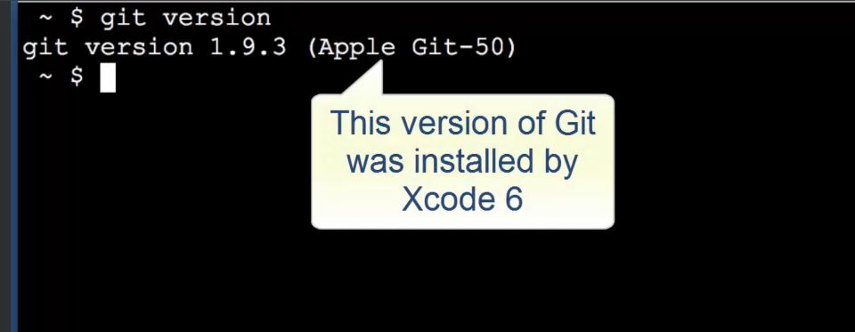
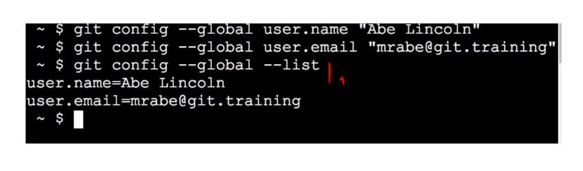
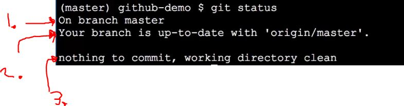
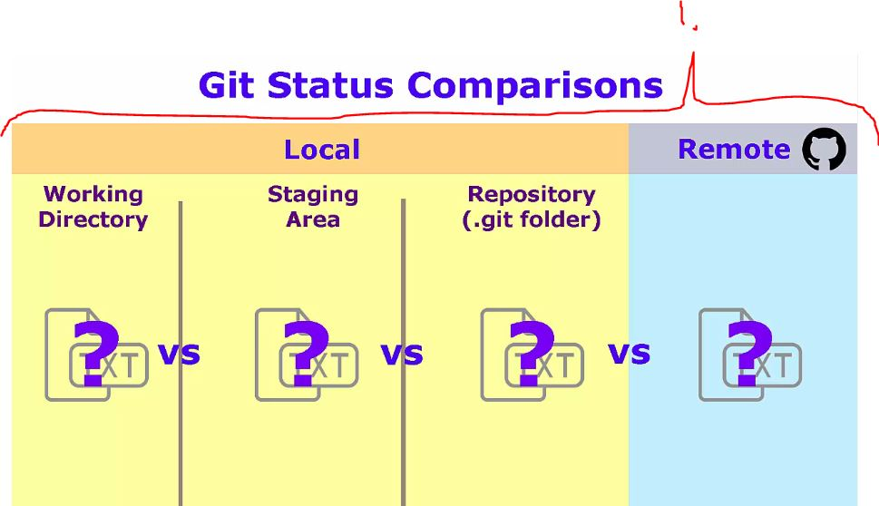
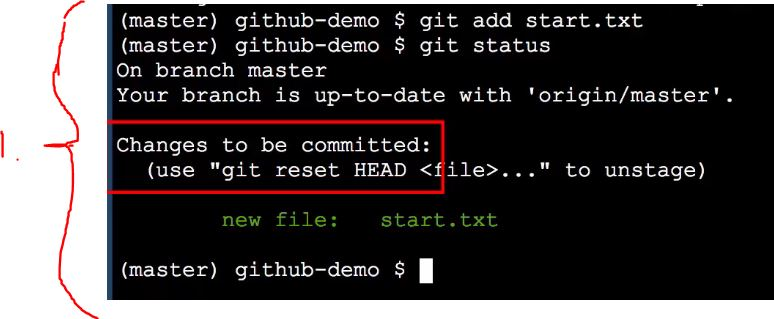
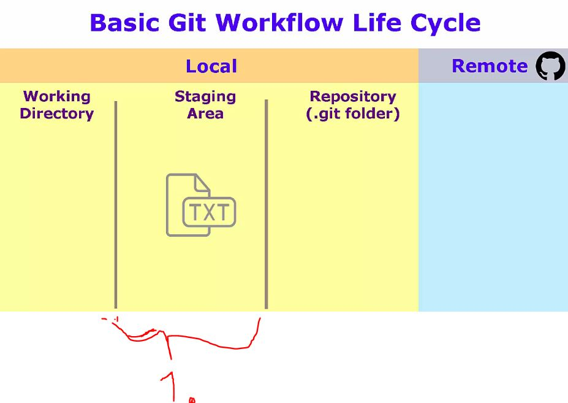
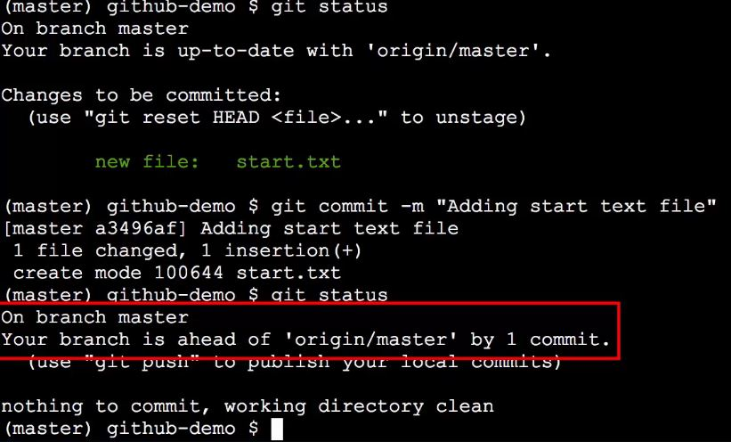
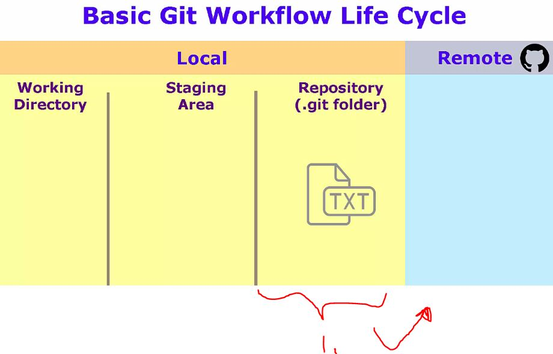

## Section 03 Git Installation

Git Installation.

# What I Learned

# Quick Start, Part 1 and 2: Configuration, Clone, and Git Basic Workflow

- Register to website and create folder to init repository.

- [GitHub](https://github.com/)

- To check version of **Git** `git version`.

- Git **needs** email and name. If not provided, Git will try to figure it out(this is not best way).

Set name.
- `git config --global user.name "Your Name"`

Set email.
- `git config --global user.email "yourEmail@here.com"`

1. You can see that data has been saved with following command. 

List all the configuration from global or from user level.
- `git config --global --list`

Clone my repository to local system.
- `git clone https://github.com/developersCradle/starter-web`
 
Ask git status.
- `git status`

1. **master** branch is default branch of git repository.
2. Tells branch is up to date with 'origin/master'.
    - Refers to online repository not local one.

- **git clone** automatically set reference to repository on github and names it **origin**.
3. working are is clean.

1. `git status` tells the status between theses stages.

1. Here we add some file to **staging area**.

1. Staging area is designed for holding many separated changes, so you can commit changes **one cohesive unit**.

1. Now changes has been committed and local branch is one commit forward than remote branch.

1. Now these changes are in local repository. They are waiting to be pushed to remote repository.

Pushing(**origin** refers to the GitHub copy of our repository, master is branch name on GitHub).
- `git push origin master`.
    - First ever commit will ask username and password.