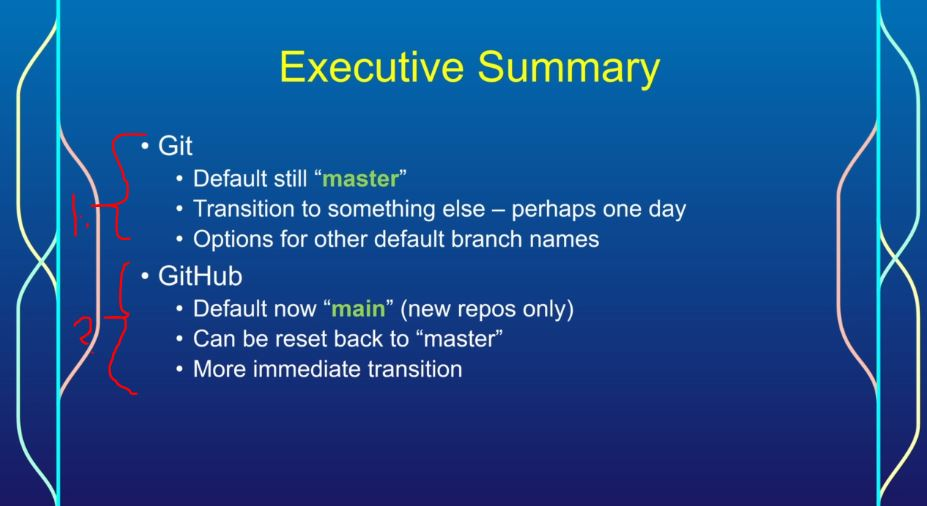
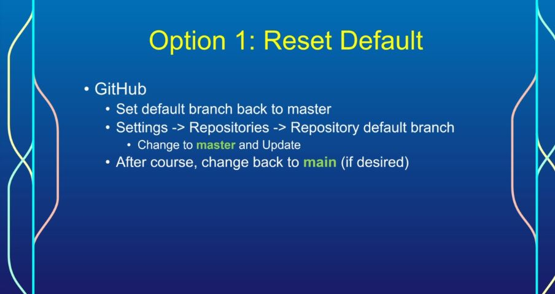
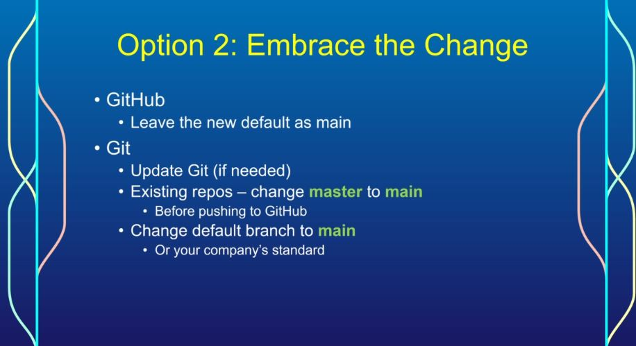

## Section 04 GitHub Updates  

GitHub Updates  

# What I Learned

# New Default Branch on GitHub

1. Git community has started to shift away from  Default **master** branch name.
2. **GitHub** most popular one for Git hosting. Has changed to use **main** for new repos only.

- There is two ways to default back to old way using **master**.

 

- Configuring default branch: `git config --global init.defaultBranch main`.

- Checking default configurations `git config --global --list`.
