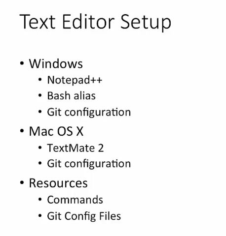
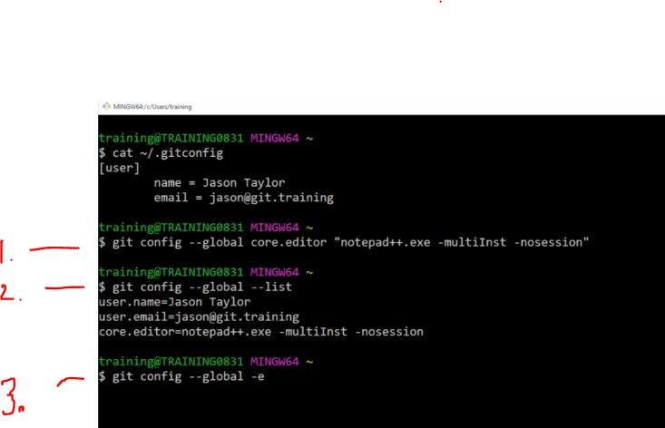

## Section 05 Text Editor Installation

Text Editor Installation

# What I Learned

# Text Editor Installation Overview

- We can cheese what text editor what we would want to use.



# Windows Text Editor: Notepad++ Installation

- [Notepad++](https://notepad-plus-plus.org/)

- We can add to to system variables to start from cmd!

# Configure Notepad++ with Git (Windows Only)

- Create `.bash_profile` file to home directory.
    - Configure Notepad++ with Git.

### content of .bash_profile
```
alias npp='notepad++.exe -multiInst -nosession'
```
- Now command `npp` should launch Notepad++ automatically.

Adding core editor to git config.
- `git config --global core.editor "notepad++.exe -multiInst -nosession"`



