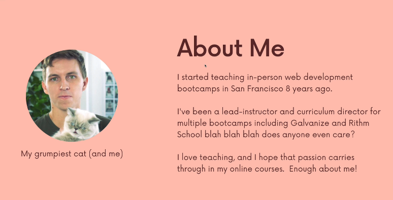

# Section 01 Introduction.

Introduction.

# What I Learned.

# Introduction.

# Welcome To The Course!

- The best dude.

- Learn **GIT** sooner is better!
    - Git needs to be **second nature**.

# Join Our Community!.

- Different links for asking question ✅.

# What The Course Covers.

- Core function are important ✅.

# A Note On The Exercises.

- With GIT, it's about git flow.
- First do exercise yourself, then watch video.

# Accessing The Slides & Diagrams.

- Slides are there ✅.

# IMPORTANT NOTE: About The Slides Links.