# Section 15: Rebasing: The Scariest Git Command?

Rebasing: The Scariest Git Command?

# What I Learned.

# What Really Matters In This Section.

- **Rebase** you don't need to use, but It's good to use.

- **Rebase** vs **Merging**, behaves differently.

# Why is Rebasing Scary? Is it?

- `Rebase` is either used a lot in a company or avoided by plague!


<br>

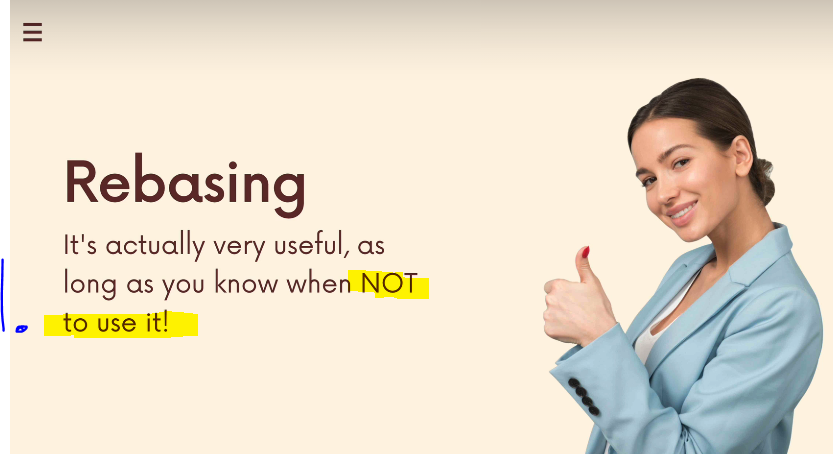

1. You need to know when **NOT** to use `rebasing`. There is **Golden** rule of rebasing.

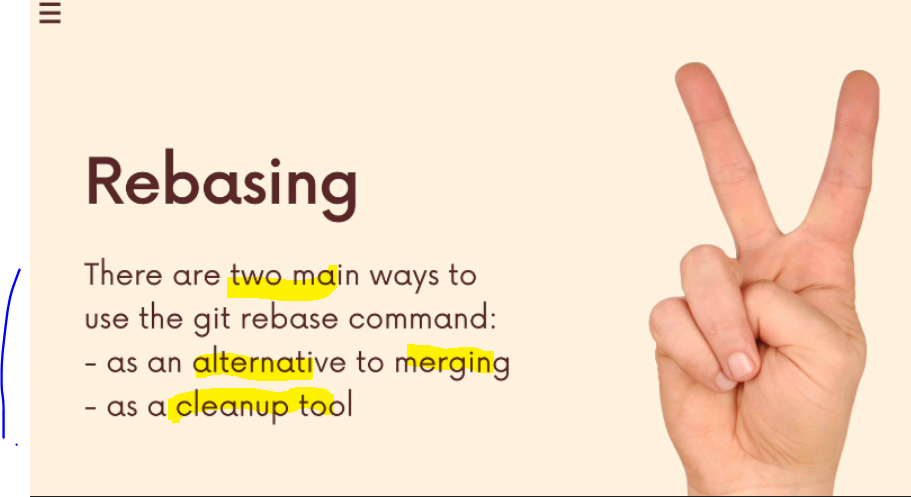

1. Rebase has **two** main ways of usage:
    - As **alternative** to **merging**.
    - As **cleanup** tool.

# Comparing Merging & Rebasing.

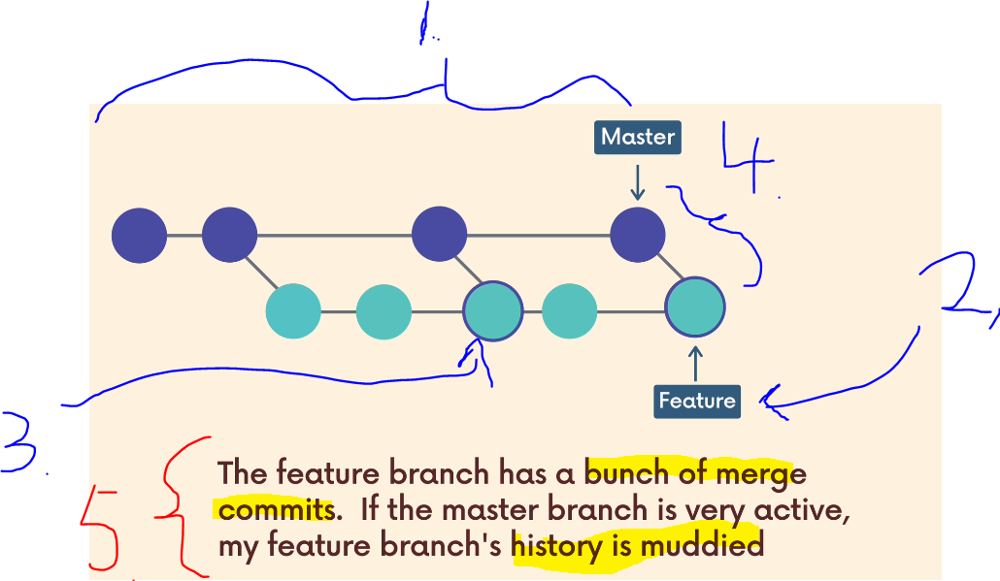

1. There are **many** commits before we start working in our `feature` branch in the `master` branch.
2. Then we just start developing in the `feature` branch.
3. We want the `Feature` branch the commits from `Master` **at this time**!
    - This, so will **merge** commit in **purple border color**.
4. Once again we **want** stuff from the `master` branch.
    - We will **have** again the **merge** commit in the commit history!
5. There are many other **developers** working for the `master` branch, and it's **very** active. Do we really want all this **MERGE COMMITS** in our `feature` branch, which in the **end** does not say **anything** and the branch gets **muddy**.
    - In the **end** when the `feature` branch is **merged** into `master` branch, there **will** be **non informative to merge commits**, which does not say anything!

- Some documentation [Git rebase](https://git-scm.com/docs/git-rebase).

> [!IMPORTANT]
> Problem with `rebase` is that it will **re-write history**!

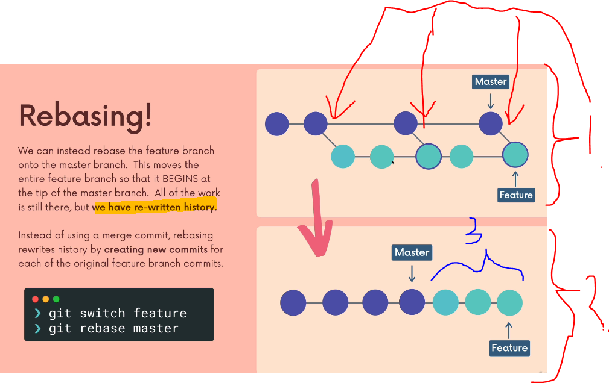

1. **Merging** creates these **merge commits**.
2. **Rebase** re-writes the history as **one**!
    - ✅No merge commits✅.
    - ❌No time **stamps** when these were **originally** written ❌.
    - ❌Hashes are also changed ❌. 
3. **Commits** from the `feature` branch will be added to **tip** of the `master` branch.

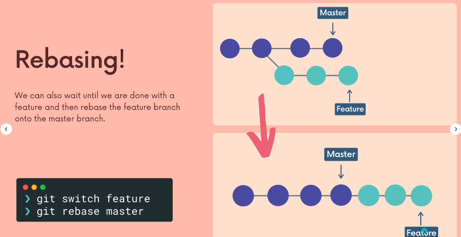

# Rebase Demo Pt 1: Setup & Merging.

- History of commands for this demo.

```
# We init the repo for demo.
git init
# We create the website.txt.
touch website.txt
# We add the website.txt.
git add website.txt
git commit -m "init"
# We add some stuff to repo.
git commit -am "add some stuff"
# We are switching to feature branch.
git switch -c feat master
# We will be working our incredible feature.
touch feature.txt.
# We will be adding something to our feature.
git add feature.txt
git commit -m "beging feature"
# Here we have modified our feature txt in VisualStudio. We are at feat branch.
git commit -am "work on the feature"
# We are going back to master branch.
git switch master
# We add new work for the master branch.
# In this example, we add something for the website.txt and add it. We are at master branch.
git commit -am "add footer"
# Here is the status update of below.
```

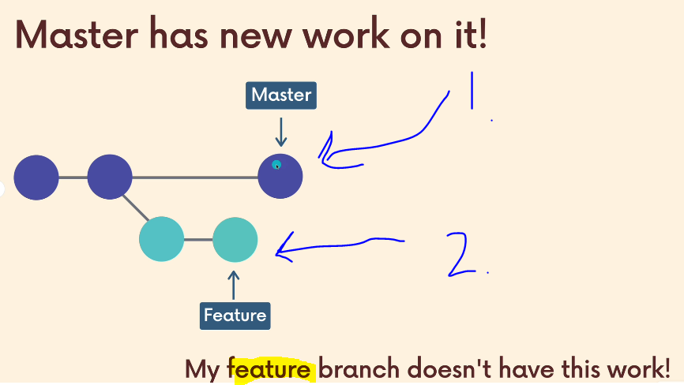

1. `Master` branch has **commits**, which we don't have in the feature `branch`.
2. Our `feature` branch does not have same **commits** as in the `master`.


1. **Looking** in branch view, you can see **two** different branches.
    - If we want the commits form the `master` branch to the `feature` branch, we could make the **merge**.
        - We would say **merge master into feature branch**, notice the order.


```
git merge master
git log --oneline
```
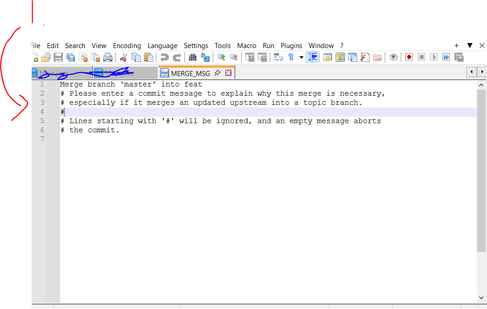

1. **Merge commit** and this will be saved in the git history.

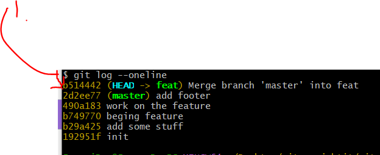

1. Now we have this **merge commit** in the logs.

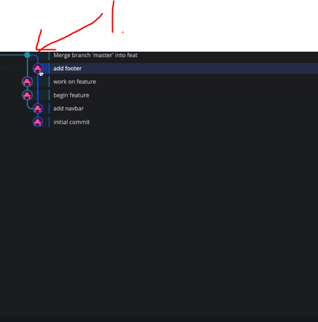

1. Also, the branch in **GUI** after commits. You can see the **merge**.

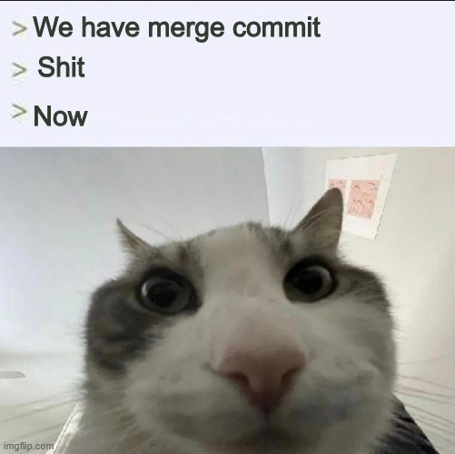

```
# Adding here stuff to feature.txt in feature branch.
git commit -am "more work on feature"
git switch master
# Adding login form to website.txt
git commit -am "add login form"
```


1. **Once again** we want to go to master and `merge` master to `feature` branch.

```
git switch feat
git merge master
```

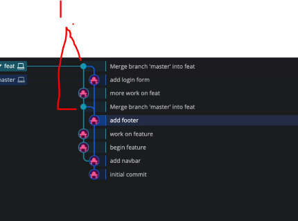

1. We will have these **merge** commits in history.

- This is where **rebasing** will come to help, clean history!

# Rebasing Demo Pt 2: Actually Rebasing.

- The same, but with **rebasing**, we need update `feat` branch weekly.

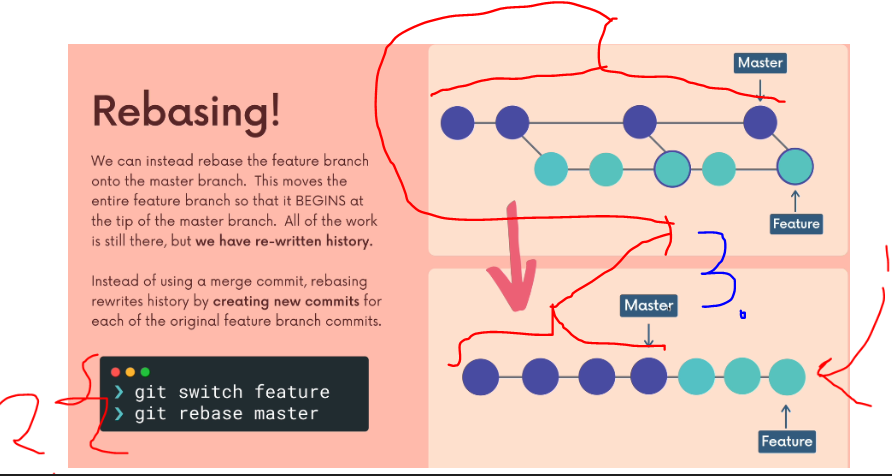

1. **Rebase** will be making history linear.
2. Workflow is here following:
    - So we will go to `feature` branch, and after we will `rebase` **master**
3. We will go into to the `feature` branch and, when we call the `rebase` on the `master` branch. **Rebase** = put your work after someone else's work, hence **rebasing** them.
    - **Linear structure**

```
git switch feature
git rebase master
```
- The **rebase** message structure:

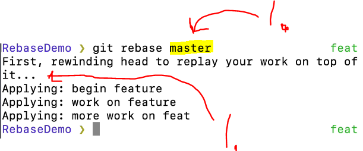

1. `rewinding head to replay your work on top of it ...`, to of **master**.

- **Before** `rebase`.

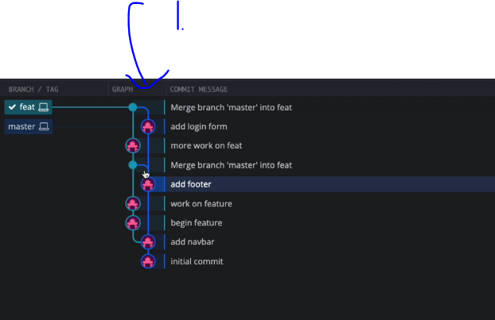

1. Before **rebase** command.

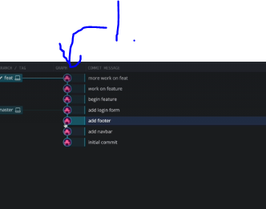

- **After** `rebase` branches are in **linear form**.

- To get logs `git log --oneline`.


1. You can see the **hashes** are different after **rebase**.
2. Also, the **merge** commits are gone.
3. `feature` branch **commits** are on the top.
4. `master` is pointing here and, as you can see the `master` branch commits **after** the `feat` commits.

- As you can see ✅ **Clean up** ✅ the **merge** commits, while the commits from `master` got appended.

- Example of `rebasing` to top of `develop`.

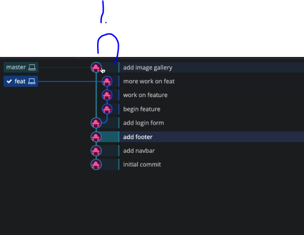

1. We will **rebase** commits, top of `feat` form `master`.

```
git switch master
# We add here something to the website.txt
git commit -am "add image gallery"
git switch feat
git rebase master
```

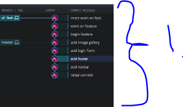

1. As you can see, there is this **linear structure**, and **NO** need to **merge**!

<p align="center">
    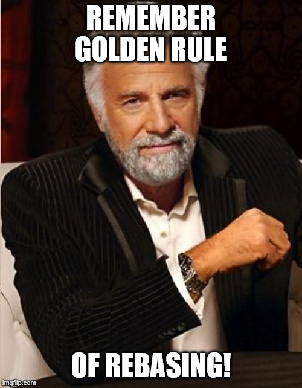
</p>

# The Golden Rule: When NOT to Rebase.

