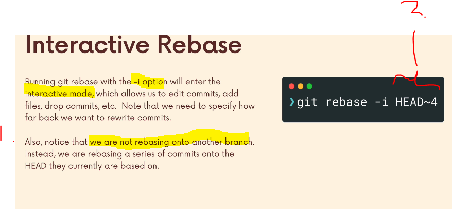
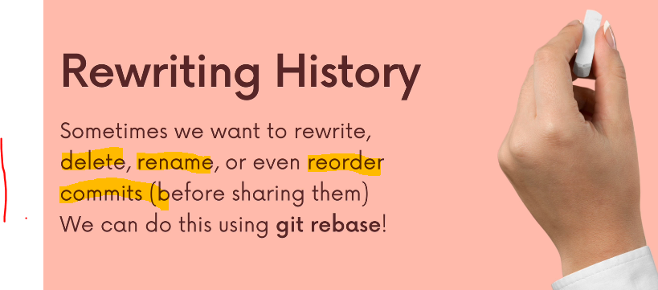
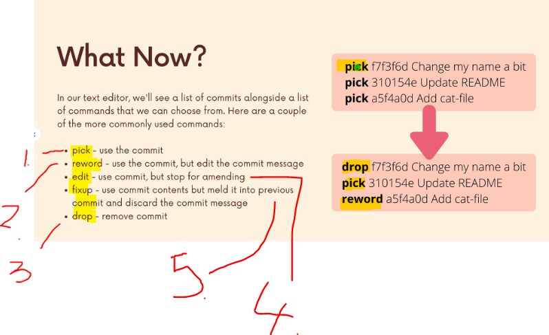
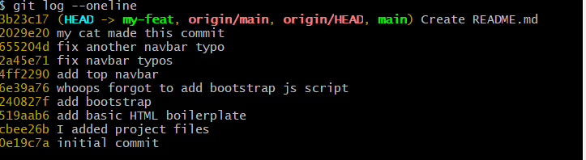
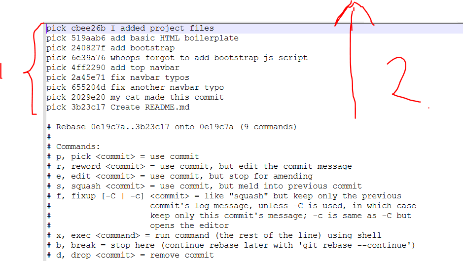
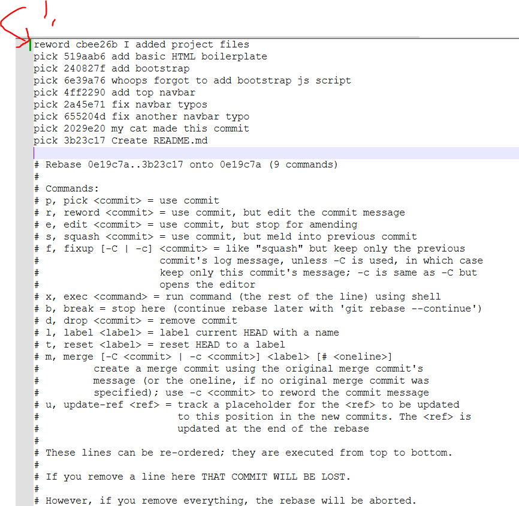
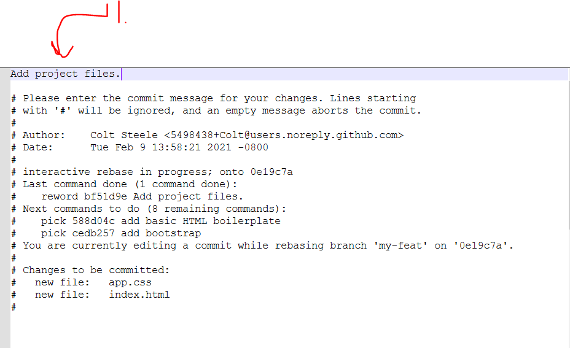
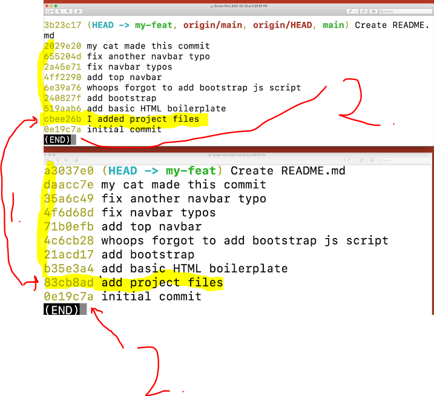
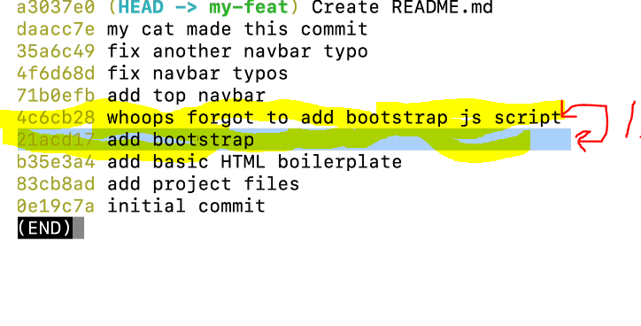
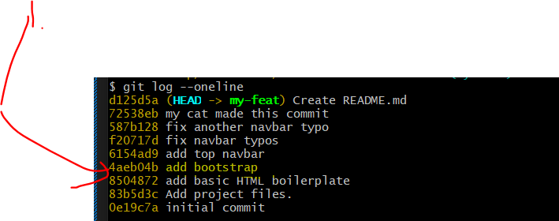

## Section 16: Cleaning Up History With Interactive Rebase.

Cleaning Up History With Interactive Rebase.

# What I Learned

# Introduction

# What Really Matters In This Section.

- **Interactive Rebase**, has many applications.
    - Go back edit/manipulate history.



# Introducing Interactive Rebase.



1. Git interactive, you can `rewrite` `delete`, `rename`, `reorder` commits.

- We don't want to **re-write** history what others have been made already.

- It's nice tool, to clean up, before merge into `master`.


- Example of the command `git rebase -i HEAD~4`.
    - This goes back **4** steps.
1. Notice the that `reabase` with **interactive**, is based on the current **branch**, NOT to the **other branch**.
2. Second parameter is the **range**.

# Rewording Commits With Interactive Rebase.

- Example for the rewriting the repo comments [Repo link](https://github.com/Colt/interactive-rebase-demo).

- We want to **minimize** the commits that we are going **back**! 

```
2029e20 my cat made this commit
655204d fix another navbar typo
2a45e71 fix navbar typos
4ff2290 add top navbar
6e39a76 whoops forgot to add bootstrap js script
240827f add bootstrap
519aab6 add basic HTML boilerplate
cbee26b I added project files
0e19c7a initial commit
```
- We want to this:

```
b8f8889 add top navbar
64fa7d4 add bootstrap
4273423 add basic HTML boilerplate
0ffb0aa add project files
0e19c7a initial commit
```



- These are main action to use with `git rebase`:

1. `pick` Use the **commit** how it is atm. **Default**.
2. `reword` Change the commit message, but the **commit** itself.
3. `edit`. 
4. `fixup` we will **merge** commit to the previous and **discard** its previous commit message. 
5. `drop`.

- There are many other **parameters**, but these are the most common. 

- Let's explore **git before** **rebase** `git log --oneline`.



- We are using the `git rebase -i HEAD~9` **rebase** 9 commits. 

- **Next** will be opening following window.



1. You will have **text editor** for the picking the **option**. 
2. **Notice** the order is **reverse** compared to the `git log --oneline` log in the upper picture.
    - **Git** will start **executing** the commands from up to down.



1. We are **rewording** the first commit with the `reword`. Change the `pick` to `reword`. 

- Next step will be rewording.


1. Next, we will be rewriting the commit message. Hence, `I added project files` → `Add project files.`.

- You will be **editing** the **commit message** in other window.



1. Modify message here.



1. You can see the **commit message** changed and, also the **commit message**.

2. Notice the **first** commit **hash** is the same, but all others are **rewritten**!

- The commands what we were using:

```
git clone https://github.com/Colt/interactive-rebase-demo
git switch -c my-feat
git log --oneline
git rebase -i HEAD~9
# Option was selected here.
git log --oneline
```

# Fixing Up & Squashing Commits With Interactive Rebase.



1. We want to combine these **two** commits. We can do this with the `fixup` parameter.

- `fixup` Could be better option to use than `squash`.

- We will be using `fixup`:
    - `pick bed0b2b add bootstrap` the `fixup` commit will be **merged** into `pick bed0b2b add bootstrap` commit!

```
pick 83b5d3c Add project files.
pick 8504872 add basic HTML boilerplate
pick bed0b2b add bootstrap
fixup a919316 whoops forgot to add bootstrap js script
pick 0c73c01 add top navbar
pick c90f7a6 fix navbar typos
pick 009c54e fix another navbar typo
pick 0215d2f my cat made this commit
pick 41a4486 Create README.md

# Rebase 0e19c7a..41a4486 onto 0e19c7a (9 commands)
#
# Commands:
# p, pick <commit> = use commit
# r, reword <commit> = use commit, but edit the commit message
# e, edit <commit> = use commit, but stop for amending
# s, squash <commit> = use commit, but meld into previous commit
# f, fixup [-C | -c] <commit> = like "squash" but keep only the previous
#                    commit's log message, unless -C is used, in which case
#                    keep only this commit's message; -c is same as -C but
#                    opens the editor
# x, exec <command> = run command (the rest of the line) using shell
# b, break = stop here (continue rebase later with 'git rebase --continue')
# d, drop <commit> = remove commit
# l, label <label> = label current HEAD with a name
# t, reset <label> = reset HEAD to a label
# m, merge [-C <commit> | -c <commit>] <label> [# <oneline>]
#         create a merge commit using the original merge commit's
#         message (or the oneline, if no original merge commit was
#         specified); use -c <commit> to reword the commit message
# u, update-ref <ref> = track a placeholder for the <ref> to be updated
#                       to this position in the new commits. The <ref> is
#                       updated at the end of the rebase
#
# These lines can be re-ordered; they are executed from top to bottom.
#
# If you remove a line here THAT COMMIT WILL BE LOST.
#
# However, if you remove everything, the rebase will be aborted.
#
```



1. You can see that the **commit** got **merged** to **previous**. You could check the content and see that its having **both** content.
    - This is just **log**.

- The history **hashes** are **rewritten** from top.

- The commands below for this: 

```
git rebase -i HEAD~9
# Give appropriated option
git log --online
```

# Dropping Commits With Interactive Rebase.

- Removing **horrible** commit.
    - `git reabase -i HEAD~~2`. Then give following parameter.

- We will be using the `drop 72538eb my cat made this commit`.
    - This will **remove** the message and **content** itself.

```
pick 587b128 fix another navbar typo
drop 72538eb my cat made this commit
pick d125d5a Create README.md

# Rebase f20717d..d125d5a onto f20717d (3 commands)
#
# Commands:
# p, pick <commit> = use commit
# r, reword <commit> = use commit, but edit the commit message
# e, edit <commit> = use commit, but stop for amending
# s, squash <commit> = use commit, but meld into previous commit
# f, fixup [-C | -c] <commit> = like "squash" but keep only the previous
#                    commit's log message, unless -C is used, in which case
#                    keep only this commit's message; -c is same as -C but
#                    opens the editor
# x, exec <command> = run command (the rest of the line) using shell
# b, break = stop here (continue rebase later with 'git rebase --continue')
# d, drop <commit> = remove commit
# l, label <label> = label current HEAD with a name
# t, reset <label> = reset HEAD to a label
# m, merge [-C <commit> | -c <commit>] <label> [# <oneline>]
#         create a merge commit using the original merge commit's
#         message (or the oneline, if no original merge commit was
#         specified); use -c <commit> to reword the commit message
# u, update-ref <ref> = track a placeholder for the <ref> to be updated
#                       to this position in the new commits. The <ref> is
#                       updated at the end of the rebase
#
# These lines can be re-ordered; they are executed from top to bottom.
#
# If you remove a line here THAT COMMIT WILL BE LOST.
#
# However, if you remove everything, the rebase will be aborted.
#
```